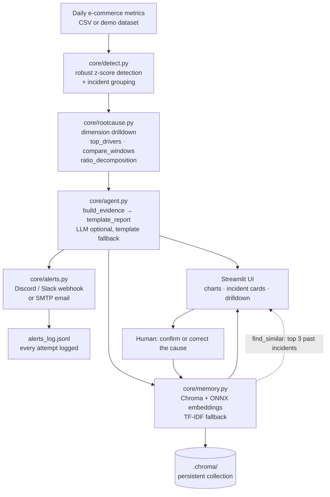

# Sentinel 🛰️

Sentinel watches your metrics, finds the root cause of every anomaly, and alerts your team with explanations grounded in real numbers.

## The problem

Dashboards tell you *that* revenue fell. They rarely tell you *which* customer
segment fell, *by how much*, or *whether you have seen this before* — and by the
time someone connects the dots, the spike is last week and the Slack thread is
long gone. An LLM alone makes this worse: it will happily invent a plausible
cause for a number nobody computed.

Sentinel closes that gap by putting the analysis in deterministic code first, and
letting the model do nothing but narrate. The tools return the numbers; the
narration may only state numbers the tools produced. A wrong cause becomes a
formatting bug, not an analysis bug.

## Architecture



## How it works

**1. Detection — `core/detect.py`.**
Daily metrics are reshaped from long format and flagged day by day with a robust
z-score (median/MAD) that a single outlier weekend cannot poison. Consecutive
flagged days collapse into a single `Incident` with a severity, a peak day, and
the observed vs expected values.

**2. Root cause — `core/rootcause.py`.**
Pure Python, three tools:
`top_drivers` ranks every segment by how much of the total change it explains,
preferring the most specific cut; `compare_windows` measures one segment against
its own same-weekday baseline; `ratio_decomposition` splits revenue into
sessions × conversion × AOV so the three effects sum to the net change. This is
where every attributed number comes from.

**3. Grounded narration — `core/agent.py`.**
`build_evidence` runs the three tools, and `template_report` turns their output
into a headline, what changed, the likeliest driver, evidence lines, and
recommended checks. The contract is strict: the model may only state numbers a
tool returned, and any claim about cause must trace back to a drilldown result.
The LLM is optional and currently not wired in, so the deterministic template is
the live path.

**4. Memory — `core/memory.py`.**
Each incident's `headline + metric + driver + cause` is embedded and stored in a
persistent Chroma collection, with the fields kept as metadata. `find_similar`
builds a query from the current report and returns the top 3 past incidents with a
similarity score. Embeddings use Chroma's built-in ONNX model, so there is no
sentence-transformers and no PyTorch. If Chroma cannot initialize, a scikit-learn
TF-IDF + cosine store takes over with identical signatures.

**5. Alerts — `core/alerts.py`.**
`format_alert` renders a plain-text summary; `send_webhook` detects a Discord or
Slack URL and posts the right payload key (`content` vs `text`) with a 10s
timeout, truncating Discord bodies to 1900 characters; `send_email` sends over
SMTP with STARTTLS. Every attempt is appended to `alerts_log.jsonl`. A missing
webhook or SMTP host returns a friendly "not configured" message rather than
failing the run, and the webhook URL is redacted from logs and from the screen.

## Demo instructions for judges

The app runs with **no secrets and no configuration**. Demo mode is on by
default and analyzes the committed synthetic dataset.

1. Open the Space. The five metric charts and a list of incidents render
   immediately — no API keys, no signup.
2. **Look at the highlighted points.** Flagged days are marked on each chart.
3. **Expand the first incident.** It shows severity, the peak day, observed vs
   expected, and the z-score that tripped the detector.
4. **Open the Report tab.** Read the headline, what changed, the likeliest
   driver, and the evidence lines. Every number there came from a drilldown
   tool.
5. **Open Top drivers.** See the segments ranked by share of the change — this
   is the actual root-cause evidence.
6. **Open By channel / By device / By region / By category.** Each decomposes
   the metric one dimension at a time.
7. **Open Revenue split.** Revenue is decomposed into sessions × conversion ×
   AOV; the three effects sum to the net change.
8. **Read Similar past incidents.** The mobile + organic revenue drop recalls a
   seeded historical incident whose recorded cause was a broken checkout tracking
   tag. It is labelled `demo data` and worded as a *similar pattern*, not the
   same cause.
9. **Use Mark cause / resolve.** Type what actually caused it and save. It is
   stored with `is_demo=False` and becomes retrievable on the next run.
10. **Click Send alert.** With no `WEBHOOK_URL` set, it reports
    "not configured" and still logs the attempt to `alerts_log.jsonl`. Set
    `WEBHOOK_URL` in `.env` to a Discord or Slack webhook to deliver for real,
    or use the sidebar **Send test alert** to check the channel.
11. **Try Sensitivity in the sidebar.** Lower it to surface more or fewer
    incidents, then press **Run watchdog**.

## Tech stack

| Layer | Choice |
| --- | --- |
| UI | Streamlit 1.40+, Plotly |
| Data | pandas 2.2+, numpy |
| Detection | robust z-score (median/MAD), scikit-learn, statsmodels |
| Root cause | pure Python — no ML, fully auditable |
| Narration | deterministic template; LLM optional, not wired in |
| Memory | Chroma with built-in ONNX embeddings, scikit-learn TF-IDF fallback |
| Alerts | requests (Discord/Slack), smtplib (SMTP email) |
| Config | python-dotenv, `.env` git-ignored |
| Tests | pytest (94 tests) |

No PyTorch and no sentence-transformers anywhere in the dependency tree.

## Limitations

These are real constraints, stated plainly.

- **The data is synthetic.** `data/sample.csv` is generated by `data/generate.py`
  with anomalies injected on purpose. Nothing here has been validated against a
  real production store, and the absolute values mean nothing.
- **The seeded past incidents are examples, not history.** The four recalled
  incidents in memory are written by hand to demonstrate retrieval. They are
  tagged `demo data` in the UI precisely so nobody mistakes them for records of
  something that actually happened. A similar pattern is not the same cause.
- **Hugging Face disk is ephemeral.** `.chroma/` and `alerts_log.jsonl` live on
  the container filesystem, so a Space restart or rebuild can reset saved causes
  and the alert history. Treat them as a demo cache, not a system of record.
- **The LLM is optional and currently off.** Narration is the deterministic
  template, so the app works fully offline. Wiring an LLM adds no new analysis —
  it may only reformat tool output — and if the call fails or no key is set, the
  template is used instead.
- **Drivers are statistical, not proof of causation.** `top_drivers` ranks
  segments by how much of a change they explain, measured against their own
  same-weekday baseline. A segment explaining 80% of a drop is a strong lead,
  not a demonstrated cause. Confounding is not controlled for, and the
  "recommended checks" are the step that would actually confirm it.
- **Detection is univariate and weekday-aware.** It flags one metric at a time
  against its own history. It will not catch a slow drift that never crosses the
  z-score threshold, nor a coordinated change that is normal for every single
  metric in isolation.

## Running locally

```bash
python -m venv .venv
# Windows: .venv\Scripts\activate
# POSIX:  source .venv/bin/activate
pip install -r requirements.txt
copy .env.example .env   # Windows (POSIX: cp .env.example .env)
streamlit run app.py
```

Requires Python 3.11+. Tests: `python -m pytest`.

## License

MIT — see [LICENSE](LICENSE).
